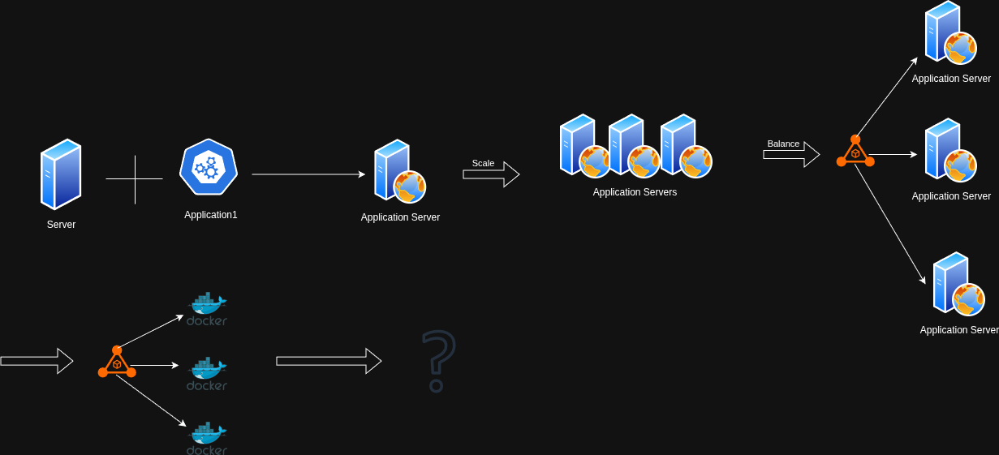
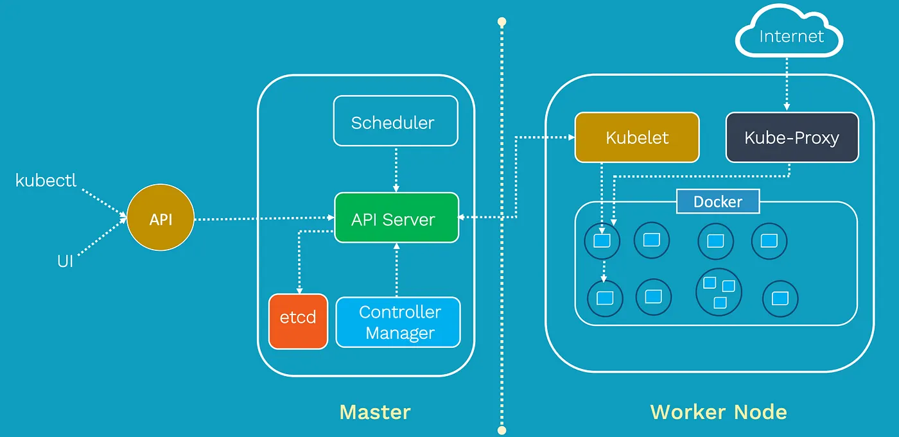
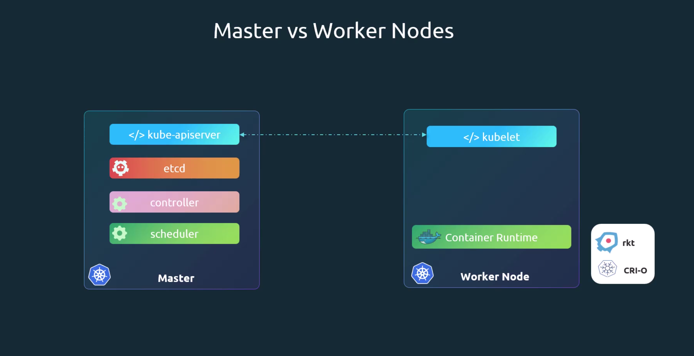
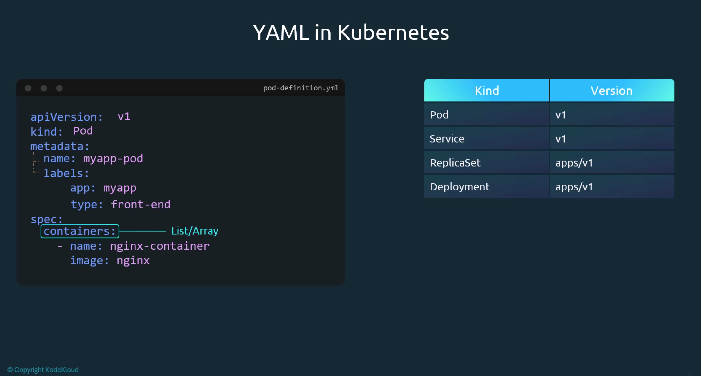
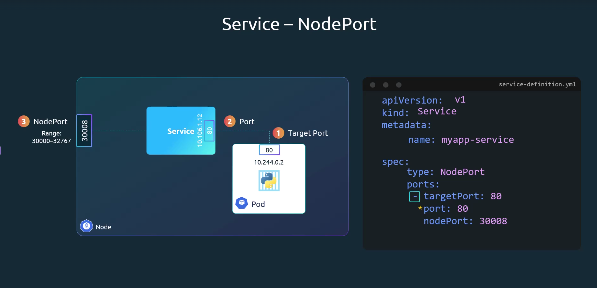
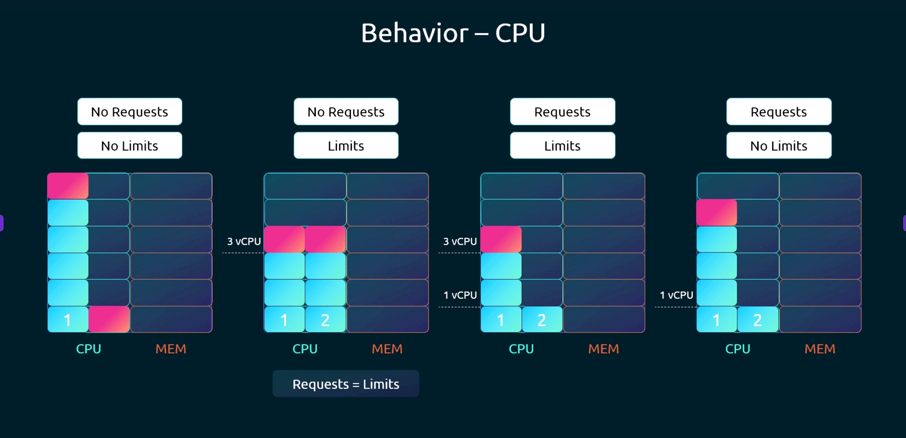
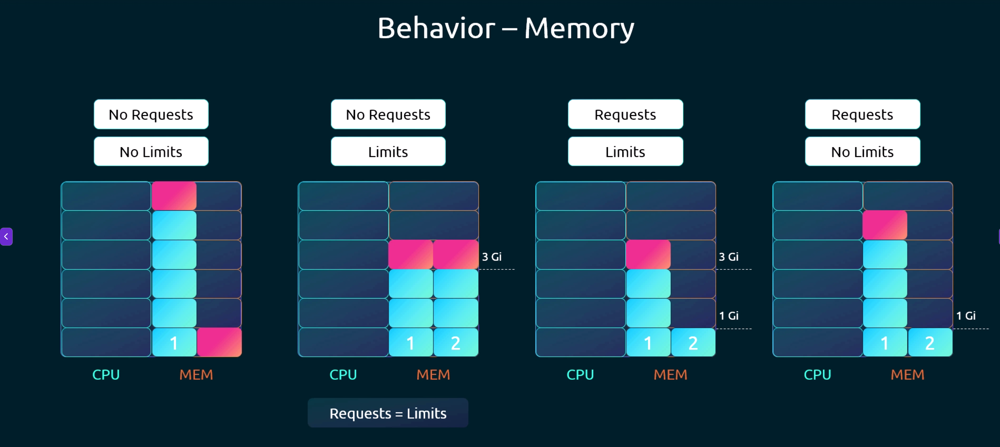
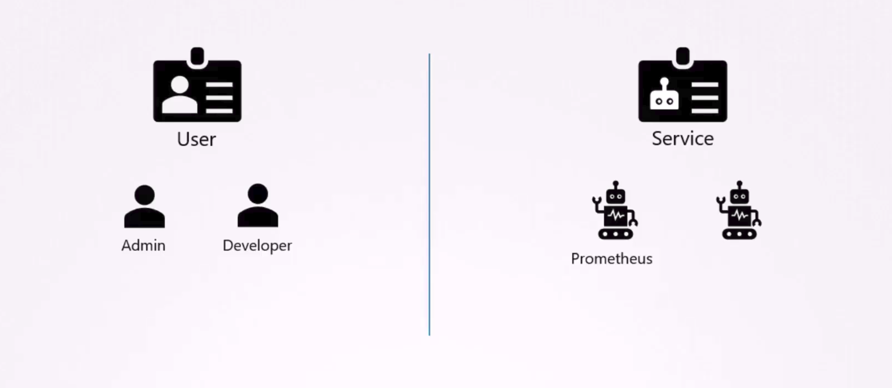

- [Kubernetes](#kubernetes)
- [Kubernetes Components](#kubernetes-components)
  - [ETCD](#etcd)
  - [API Server](#api-server)
  - [Scheduler](#scheduler)
  - [Controller](#controller)
  - [Container Runtime](#container-runtime)
  - [Kubelet](#kubelet)
- [Master vs Worker Nodes](#master-vs-worker-nodes)
  - [Cluster Info](#cluster-info)
- [CRI](#cri)
    - [OCI standart](#oci-standart)
    - [ctr](#ctr)
    - [nerdctl:](#nerdctl)
    - [crictl](#crictl)
    - [Extract pod definition from run](#extract-pod-definition-from-run)
- [Kinds](#kinds)
  - [Replication Controller](#replication-controller)
  - [ReplicaSet](#replicaset)
  - [Deployment](#deployment)
  - [Namespaces](#namespaces)
  - [Services](#services)
    - [Types of Services:](#types-of-services)
- [Resource Quota](#resource-quota)
- [Kubectl Explain](#kubectl-explain)
- [Kubernetes with command and args for Docker](#kubernetes-with-command-and-args-for-docker)
- [ConfigMaps](#configmaps)
    - [Imperative:](#imperative)
    - [Declarative](#declarative)
- [Secrets](#secrets)
  - [Types of secrets](#types-of-secrets)
    - [Opaque Secrets](#opaque-secrets)
    - [Service Account Token Secrets](#service-account-token-secrets)
    - [Docker Config Secrets](#docker-config-secrets)
    - [Basic AUTH secret](#basic-auth-secret)
    - [TLS Secrets](#tls-secrets)
    - [Bootstrap Token Secrets](#bootstrap-token-secrets)
  - [Imperative examples](#imperative-examples)
- [Security Context](#security-context)
- [Resource Requirements](#resource-requirements)
  - [CPU](#cpu)
  - [Memory](#memory)
  - [Limit Ranges](#limit-ranges)
- [Service Accounts](#service-accounts)
- [Taint and tolerations](#taint-and-tolerations)
      - [NoExecute](#noexecute)
      - [NoSchedule](#noschedule)
      - [PreferNoSchedule](#prefernoschedule)


# Kubernetes

First things first…what the heck is Kubernetes? Kubernetes is a container orchestration system that lets you deploy, scale, and manage containerized applications.



Kubernetes is an open source and written in Golang, the same language as Docker and a lot of other CNCF native soltuions. Kubernetes helps to operate and manage containerized apps. Kubernetes provides a platform for deploying, scaling and managing containerized applications. 


# Kubernetes Components



## ETCD
ETCD is an open-source, distributed key-value storage system that facilitates the configuration of resources, the discovery of services, and the coordination of distributed systems such as clusters and containers. Its functionalities include distributing and scheduling work across multiple hosts, enabling automatic updates that are safer, and setting up overlay networking for containers. etcd is designed to maintain redundancy and resilience in cloud systems and is the standard storage system used in Kubernetes. 

## API Server
The API server in Kubernetes is the core control plane component that provides an interface to the Kubernetes API. It accepts, processes, and validates requests from users, applications, and other Kubernetes components, maintaining state consistency across the cluster. Think of it as the “traffic controller” for your cluster—directing requests, enforcing rules, and ensuring everyone follows the plan.

## Scheduler
The Kubernetes scheduler is a control plane process which assigns Pods to Nodes. The scheduler determines which Nodes are valid placements for each Pod in the scheduling queue according to constraints and available resources. The scheduler then ranks each valid Node and binds the Pod to a suitable Node. Multiple different schedulers may be used within a cluster; kube-scheduler is the reference implementation. See scheduling for more information about scheduling and the kube-scheduler component.

## Controller
In robotics and automation, a control loop is a non-terminating loop that regulates the state of a system.

Here is one example of a control loop: a thermostat in a room.

When you set the temperature, that's telling the thermostat about your desired state. The actual room temperature is the current state. The thermostat acts to bring the current state closer to the desired state, by turning equipment on or off.

In Kubernetes, controllers are control loops that watch the state of your cluster, then make or request changes where needed. Each controller tries to move the current cluster state closer to the desired state.

## Container Runtime
A container runtime is the foundational software that allows containers to operate within a host system. Container runtime is responsible for everything from pulling container images from a container registry and managing their life cycle to running the containers on your system.

## Kubelet
A Kubelet in Kubernetes is a crucial component of the primary node agent that runs on each node. It assists with container management and orchestration within a Kubernetes cluster. Kubelet supports communication between the Kubernetes control plane and individual nodes and it also enables the efficient deployment and execution of containerized applications across the cluster.

# Master vs Worker Nodes




## Cluster Info

Run on cluster:
```bash
kubectl run hello-minikube
``` 

Info about cluster:
```bash
kubectl cluster-info
``` 

List nodes of the cluster:
```bash
kubectl get nodes
``` 

# CRI

Container runtime interface allowes any solution to act as cointainer runtime as long as they implement OCI standart.

### OCI standart
  - image spec - specification on how an image should be built
  - runtime spec - how any container runtime should be developed


Containerd - docker pulled its core container runtime into a standalone project. Containerd is CRI compatible so it can be used separately. 

### ctr 
  - comes with containerd
  - not very user friendly
  - limited feature support 

### nerdctl:
  - provides a Docker like CLI for containerd
  - nerdctl suppports Docker compose
  - nerdctl supports newest features
  - supports encrypted container images
  - lazy pulling
  - P2P image distribution
  - Image signing and verifying

```bash
nerdctl run --name redis redis:alpine
nerdctl run --name webapp -p 80:80
``` 

### crictl 
 - from kubernetes prospective tool which works with all compatible runtimes
 - installed separately
 - used to inspect and debug container runtimes
 - not to create containers
 - works across different runtimes
 - if you create container on kubernetes kubelet will delete container

```bash
crictl pull busybox
crictl images
crictl ps -a
crictl logs <name>
crictl pods
``` 

### Extract pod definition from run

```bash
kubectl run redis --image=redis --dry-run=client -o yaml > redis.yaml

kubectl get pod <pod-name> -o yaml > pod-definition.yaml
``` 

# Kinds



## Replication Controller

A ReplicationController ensures that a specified number of pod replicas are running at any one time. In other words, a ReplicationController makes sure that a pod or a homogeneous set of pods is always up and available.
A Deployment that configures a ReplicaSet is now the recommended way to set up replication.

 
## ReplicaSet
A ReplicaSet's purpose is to maintain a stable set of replica Pods running at any given time. Usually, you define a Deployment and let that Deployment manage ReplicaSets automatically.
A ReplicaSet's purpose is to maintain a stable set of replica Pods running at any given time. As such, it1§is often used to guarantee the availability of a specified number of identical Pods.


```bash
kubectl scale --replicas=6 -f definitions/replicaset.yaml

kubectl scale --replicas=6 replicaset myapp-replicaset

kubectl apply -f definitions/replicaset.yaml

kubectl explain replicaset # will show docs for replicaset
``` 

## Deployment 
Provides additional features such as rolling updates, rollbacks and versioning of the application


```bash
kubectl apply -f definitions/deployment.yaml
``` 

```bash
kubectl create deployment --image=nginx nginx
``` 

Generate Deployment YAML file (-o yaml). Don't create it(--dry-run):

```bash
kubectl create deployment --image=nginx nginx --dry-run -o yaml
``` 

```bash
kubectl create deployment nginx --image=nginx--dry-run=client -o yaml > nginx-deployment.yaml
```

Generate Deployment with 4 Replicas

```bash
kubectl create deployment nginx --image=nginx --replicas=4
``` 

## Namespaces
In Kubernetes, namespaces provide a mechanism for isolating groups of resources within a single cluster. Names of resources need to be unique within a namespace, but not across namespaces. Namespace-based scoping is applicable only for namespaced objects (e.g. Deployments, Services, etc.) and not for cluster-wide objects (e.g. StorageClass, Nodes, PersistentVolumes, etc.).


```bash
kubectl get all -n <namespace-name>

kubectl apply -f definitions/namespace.yaml
``` 

## Services
Expose an application running in your cluster behind a single outward-facing endpoint, even when the workload is split across multiple backends.
In Kubernetes, a Service is a method for exposing a network application that is running as one or more Pods in your cluster.

### Types of Services:
  - ClusterIP - Exposes the Service on a cluster-internal IP. 
  - NodePort - Exposes the Service on each Node's IP at a static port (the NodePort). 
    
  - LoadBalancer - Exposes the Service externally using an external load balancer. 


Create a Service named nginx of type NodePort to expose pod nginx's port 80 on port 30080 on the nodes:

```bash
kubectl expose pod nginx --port=80 --name nginx-service --type=NodePort --dry-run=client -o yaml
```

(This will automatically use the pod's labels as selectors, but you cannot specify the node port. You have to generate a definition file and then add the node port in manually before creating the service with the pod.)

Or

```bash
kubectl create service nodeport nginx --tcp=80:80 --node-port=30080 --dry-run=client -o yaml
```
(This will not use the pods' labels as selectors)

Both the above commands have their own challenges. While one of it cannot accept a selector the other cannot accept a node port. I would recommend going with the `kubectl expose` command. If you need to specify a node port, generate a definition file using the same command and manually input the nodeport before creating the service.


Link to service from the resource: 
```bash
db-service.dev.svc.cluster.local
``` 

db-service - svc name
dev - namespace
service - svc
cluster.local - default domain of the cluster

More on services: https://kubernetes.io/docs/concepts/services-networking/service/

# Resource Quota 
When several users or teams share a cluster with a fixed number of nodes, there is a concern that one team could use more than its fair share of resources.

Resource quotas are a tool for administrators to address this concern.

A resource quota, defined by a ResourceQuota object, provides constraints that limit aggregate resource consumption per namespace. A ResourceQuota can also limit the quantity of objects that can be created in a namespace by API kind, as well as the total amount of infrastructure resources that may be consumed by API objects found in that namespace.

```bash
kubectl apply -f definitions/resource-quota.yaml
```

# Kubectl Explain

kubectl [command] [type] [name] - o <ouput_format>

 - -o json -output a json fomatted API object
 - -o name -output a resource name
 - -o wide -output plaintext format wit any additional data
 - -o yaml -output a yaml formatted object

```bash
  # Get the documentation of the resource and its fields
  kubectl explain pods
  
  # Get all the fields in the resource
  kubectl explain pods --recursive
  
  # Get the explanation for deployment in supported api versions
  kubectl explain deployments --api-version=apps/v1
  
  # Get the documentation of a specific field of a resource
  kubectl explain pods.spec.containers
  
  # Get the documentation of resources in different format
  kubectl explain deployment --output=plaintext-openapiv2
```

# Kubernetes with command and args for Docker

Define a command and arguments when you create a Pod
When you create a Pod, you can define a command and arguments for the containers that run in the Pod. To define a command, include the command field in the configuration file. To define arguments for the command, include the args field in the configuration file. The command and arguments that you define cannot be changed after the Pod is created.

The command and arguments that you define in the configuration file override the default command and arguments provided by the container image. If you define args, but do not define a command, the default command is used with your new arguments.

Note:
The command field corresponds to ENTRYPOINT, and the args field corresponds to CMD in some container runtimes.

```bash
kubectl apply -f definitions/pod-commands-args.yaml
```

# ConfigMaps

A ConfigMap is an API object used to store non-confidential data in key-value pairs. Pods can consume ConfigMaps as environment variables, command-line arguments, or as configuration files in a volume.

### Imperative:

```bash
kubectl create configmap app-config --from-literal=APP_COLOR=blue --from-literal=APP_MOD=prod
```

or 

```bash
kubectl create configmap app-config --from-file=app_config.properties
```

### Declarative
```bash
kubectl apply -f definitions/configmap.yaml
```

# Secrets
A Secret is an object that contains a small amount of sensitive data such as a password, a token, or a key. Such information might otherwise be put in a Pod specification or in a container image. Using a Secret means that you don't need to include confidential data in your application code.

Because Secrets can be created independently of the Pods that use them, there is less risk of the Secret (and its data) being exposed during the workflow of creating, viewing, and editing Pods. Kubernetes, and applications that run in your cluster, can also take additional precautions with Secrets, such as avoiding writing sensitive data to nonvolatile storage.

## Types of secrets 

### Opaque Secrets
Purpose: Generic type for storing arbitrary key-value pairs.
Use Case: Ideal for storing passwords, API keys, or any non-structured sensitive data.

```bash
kubectl apply -f definitions/secrets/opaque.yaml
```

### Service Account Token Secrets
Purpose: Automatically created by Kubernetes to allow pods to authenticate with the API server.
Use Case: Used by pods to interact with the Kubernetes API.

```bash
kubectl apply -f definitions/secrets/service-account.yaml
```

### Docker Config Secrets
Purpose: Stores credentials for accessing private Docker registries.
Use Case: Used by pods to pull images from private registries.

```bash
kubectl apply -f definitions/secrets/docker-config.yaml
```

### Basic AUTH secret
Purpose: Stores credentials for basic authentication (username/password).
Use Case: Used for HTTP basic authentication.

```bash
kubectl apply -f definitions/secrets/basic-auth.yaml
```

### TLS Secrets
Purpose: Stores TLS certificates and private keys.
Use Case: Used for securing HTTPS traffic or mutual TLS (mTLS) communication.

```bash
kubectl apply -f definitions/secrets/tls.yaml
```

### Bootstrap Token Secrets
Purpose: Used during cluster bootstrapping to authenticate new nodes.
Use Case: Typically used in Kubernetes cluster setup.


```bash
kubectl apply -f definitions/secrets/bootstrap-token.yaml
```

## Imperative examples

```bash
kubectl create secret generic app-secret --from-literal=key1=value
```

or 

```bash
kubectl create secret generic app-secret --from-file=app_secret.property
```

# Security Context

Configure a Security Context for a Pod or Container
A security context defines privilege and access control settings for a Pod or Container. Security context settings include, but are not limited to:

Discretionary Access Control: Permission to access an object, like a file, is based on user ID (UID) and group ID (GID).

Security Enhanced Linux (SELinux): Objects are assigned security labels.

Running as privileged or unprivileged.

Linux Capabilities: Give a process some privileges, but not all the privileges of the root user.

AppArmor: Use program profiles to restrict the capabilities of individual programs.

Seccomp: Filter a process's system calls.

allowPrivilegeEscalation: Controls whether a process can gain more privileges than its parent process. This bool directly controls whether the no_new_privs flag gets set on the container process. allowPrivilegeEscalation is always true when the container:

is run as privileged, or
has CAP_SYS_ADMIN
readOnlyRootFilesystem: Mounts the container's root filesystem as read-only.

The above bullets are not a complete set of security context settings -- please see SecurityContext for a comprehensive list.

Set the security context for a Pod
To specify security settings for a Pod, include the securityContext field in the Pod specification. The securityContext field is a PodSecurityContext object. The security settings that you specify for a Pod apply to all Containers in the Pod. Here is a configuration file for a Pod that has a securityContext and an emptyDir volume:

```bash
kubectl apply -f descriptions/security-context.yaml
```

# Resource Requirements

When you specify a Pod, you can optionally specify how much of each resource a container needs. The most common resources to specify are CPU and memory (RAM); there are others.

When you specify the resource request for containers in a Pod, the kube-scheduler uses this information to decide which node to place the Pod on. When you specify a resource limit for a container, the kubelet enforces those limits so that the running container is not allowed to use more of that resource than the limit you set. The kubelet also reserves at least the request amount of that system resource specifically for that container to use.

This feature can be enabled by setting the PodLevelResources feature gate. The following Pod has an explicit request of 1 CPU and 100 MiB of memory, and an explicit limit of 1 CPU and 200 MiB of memory. The pod-resources-demo-ctr-1 container has explicit requests and limits set. However, the pod-resources-demo-ctr-2 container will simply share the resources available within the Pod resource boundaries, as it does not have explicit requests and limits set.

```bash
kubectl apply -f definitions/resource-requirements.yaml
```

## CPU



## Memory



## Limit Ranges

By default, containers run with unbounded compute resources on a Kubernetes cluster. Using Kubernetes resource quotas, administrators (also termed cluster operators) can restrict consumption and creation of cluster resources (such as CPU time, memory, and persistent storage) within a specified namespace. Within a namespace, a Pod can consume as much CPU and memory as is allowed by the ResourceQuotas that apply to that namespace. As a cluster operator, or as a namespace-level administrator, you might also be concerned about making sure that a single object cannot monopolize all available resources within a namespace.

```bash
kubectl apply -f definitions/limit-range.yaml
```

# Service Accounts



```bash
kubectl create serviceaccount dashboard-sa

kubectl create token dashboard-sa

kubectl get serviceaccount

kubectl describe serviceaccount dashboard-sa
```

# Taint and tolerations

Node affinity is a property of Pods that attracts them to a set of nodes (either as a preference or a hard requirement). Taints are the opposite -- they allow a node to repel a set of pods.

Tolerations are applied to pods. Tolerations allow the scheduler to schedule pods with matching taints. Tolerations allow scheduling but don't guarantee scheduling: the scheduler also evaluates other parameters as part of its function.

Taints and tolerations work together to ensure that pods are not scheduled onto inappropriate nodes. One or more taints are applied to a node; this marks that the node should not accept any pods that do not tolerate the taints.

You add a taint to a node using kubectl taint. For example,

```bash
kubectl taint nodes node1 key1=value1:NoSchedule
```

You specify a toleration for a pod in the PodSpec. Both of the following tolerations "match" the taint created by the kubectl taint line above, and thus a pod with either toleration would be able to schedule onto node1:

```bash
tolerations:
- key: "key1"
  operator: "Equal"
  value: "value1"
  effect: "NoSchedule"
```

The allowed values for the effect field are:

 #### NoExecute
This affects pods that are already running on the node as follows:
 - Pods that do not tolerate the taint are evicted immediately
 - Pods that tolerate the taint without specifying tolerationSeconds in their toleration specification remain bound forever
 - Pods that tolerate the taint with a specified tolerationSeconds remain bound for the specified amount of time. After that time elapses, the node lifecycle controller evicts the Pods from the node.
 #### NoSchedule
 - No new Pods will be scheduled on the tainted node unless they have a matching toleration. Pods currently running on the node are not evicted.
 #### PreferNoSchedule 
 - PreferNoSchedule is a "preference" or "soft" version of NoSchedule. The control plane will try to avoid placing a Pod that does not tolerate the taint on the node, but it is not guaranteed.