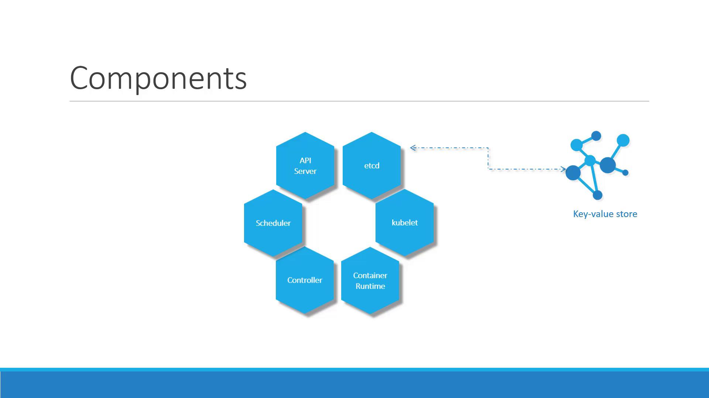

# Kubernetes Components



## ETCD
ETCD is an open-source, distributed key-value storage system that facilitates the configuration of resources, the discovery of services, and the coordination of distributed systems such as clusters and containers. Its functionalities include distributing and scheduling work across multiple hosts, enabling automatic updates that are safer, and setting up overlay networking for containers. etcd is designed to maintain redundancy and resilience in cloud systems and is the standard storage system used in Kubernetes. 

## API Server
The API server in Kubernetes is the core control plane component that provides an interface to the Kubernetes API. It accepts, processes, and validates requests from users, applications, and other Kubernetes components, maintaining state consistency across the cluster. Think of it as the “traffic controller” for your cluster—directing requests, enforcing rules, and ensuring everyone follows the plan.

## Scheduler
The Kubernetes scheduler is a control plane process which assigns Pods to Nodes. The scheduler determines which Nodes are valid placements for each Pod in the scheduling queue according to constraints and available resources. The scheduler then ranks each valid Node and binds the Pod to a suitable Node. Multiple different schedulers may be used within a cluster; kube-scheduler is the reference implementation. See scheduling for more information about scheduling and the kube-scheduler component.

## Controller
In robotics and automation, a control loop is a non-terminating loop that regulates the state of a system.

Here is one example of a control loop: a thermostat in a room.

When you set the temperature, that's telling the thermostat about your desired state. The actual room temperature is the current state. The thermostat acts to bring the current state closer to the desired state, by turning equipment on or off.

In Kubernetes, controllers are control loops that watch the state of your cluster, then make or request changes where needed. Each controller tries to move the current cluster state closer to the desired state.

## Container Runtime
A container runtime is the foundational software that allows containers to operate within a host system. Container runtime is responsible for everything from pulling container images from a container registry and managing their life cycle to running the containers on your system.

## Kubelet
A Kubelet in Kubernetes is a crucial component of the primary node agent that runs on each node. It assists with container management and orchestration within a Kubernetes cluster. Kubelet supports communication between the Kubernetes control plane and individual nodes and it also enables the efficient deployment and execution of containerized applications across the cluster.

# Master vs Worker Nodes


## Cluster Info

Run on cluster:
```bash
kubectl run hello-minikube
``` 

Info about cluster:
```bash
kubectl cluster-info
``` 

List nodes of the cluster:
```bash
kubectl get nodes
``` 

# CRI

Container runtime interface allowes any solution to act as cointainer runtime as long as they implement OCI standart.

### OCI standart
  - image spec - specification on how an image should be built
  - runtime spec - how any container runtime should be developed


Containerd - docker pulled its core container runtime into a standalone project. Containerd is CRI compatible so it can be used separately. 

### ctr 
  - comes with containerd
  - not very user friendly
  - limited feature support 

### nerdctl:
  - provides a Docker like CLI for containerd
  - nerdctl suppports Docker compose
  - nerdctl supports newest features
  - supports encrypted container images
  - lazy pulling
  - P2P image distribution
  - Image signing and verifying

```bash
nerdctl run --name redis redis:alpine
nerdctl run --name webapp -p 80:80
``` 

### crictl 
 - from kubernetes prospective tool which works with all compatible runtimes
 - installed separately
 - used to inspect and debug container runtimes
 - not to create containers
 - works across different runtimes
 - if you create container on kubernetes kubelet will delete container

```bash
crictl pull busybox
crictl images
crictl ps -a
crictl logs <name>
crictl pods
``` 

### Extract pod definition from run

```bash
kubectl run redis --image=redis --dry-run=client -o yaml > redis.yaml

kubectl get pod <pod-name> -o yaml > pod-definition.yaml
``` 

# Kinds


## Replication Controller

A ReplicationController ensures that a specified number of pod replicas are running at any one time. In other words, a ReplicationController makes sure that a pod or a homogeneous set of pods is always up and available.
A Deployment that configures a ReplicaSet is now the recommended way to set up replication.

 
## ReplicaSet
A ReplicaSet's purpose is to maintain a stable set of replica Pods running at any given time. Usually, you define a Deployment and let that Deployment manage ReplicaSets automatically.
A ReplicaSet's purpose is to maintain a stable set of replica Pods running at any given time. As such, it1§is often used to guarantee the availability of a specified number of identical Pods.


```bash
kubectl scale --replicas=6 -f definitions/replicaset.yaml

kubectl scale --replicas=6 replicaset myapp-replicaset

kubectl apply -f definitions/replicaset.yaml

kubectl explain replicaset # will show docs for replicaset
``` 

## Deployment 
Provides additional features such as rolling updates, rollbacks and versioning of the application


```bash
kubectl apply -f definitions/deployment.yaml
``` 

```bash
kubectl create deployment --image=nginx nginx
``` 

Generate Deployment YAML file (-o yaml). Don't create it(--dry-run):

```bash
kubectl create deployment --image=nginx nginx --dry-run -o yaml
``` 

```bash
kubectl create deployment nginx --image=nginx--dry-run=client -o yaml > nginx-deployment.yaml
```

Generate Deployment with 4 Replicas

```bash
kubectl create deployment nginx --image=nginx --replicas=4
``` 

## Namespaces
In Kubernetes, namespaces provide a mechanism for isolating groups of resources within a single cluster. Names of resources need to be unique within a namespace, but not across namespaces. Namespace-based scoping is applicable only for namespaced objects (e.g. Deployments, Services, etc.) and not for cluster-wide objects (e.g. StorageClass, Nodes, PersistentVolumes, etc.).


```bash
kubectl get all -n <namespace-name>

kubectl apply -f definitions/namespace.yaml
``` 

## Services
Expose an application running in your cluster behind a single outward-facing endpoint, even when the workload is split across multiple backends.
In Kubernetes, a Service is a method for exposing a network application that is running as one or more Pods in your cluster.

### Types of Services:
  - ClusterIP - Exposes the Service on a cluster-internal IP. 
  - NodePort - Exposes the Service on each Node's IP at a static port (the NodePort). 
    
  - LoadBalancer - Exposes the Service externally using an external load balancer. 


Create a Service named nginx of type NodePort to expose pod nginx's port 80 on port 30080 on the nodes:

```bash
kubectl expose pod nginx --port=80 --name nginx-service --type=NodePort --dry-run=client -o yaml
```

(This will automatically use the pod's labels as selectors, but you cannot specify the node port. You have to generate a definition file and then add the node port in manually before creating the service with the pod.)

Or

```bash
kubectl create service nodeport nginx --tcp=80:80 --node-port=30080 --dry-run=client -o yaml
```
(This will not use the pods' labels as selectors)

Both the above commands have their own challenges. While one of it cannot accept a selector the other cannot accept a node port. I would recommend going with the `kubectl expose` command. If you need to specify a node port, generate a definition file using the same command and manually input the nodeport before creating the service.


Link to service from the resource: 
```bash
db-service.dev.svc.cluster.local
``` 

db-service - svc name
dev - namespace
service - svc
cluster.local - default domain of the cluster

More on services: https://kubernetes.io/docs/concepts/services-networking/service/

# Resource Quota 
When several users or teams share a cluster with a fixed number of nodes, there is a concern that one team could use more than its fair share of resources.

Resource quotas are a tool for administrators to address this concern.

A resource quota, defined by a ResourceQuota object, provides constraints that limit aggregate resource consumption per namespace. A ResourceQuota can also limit the quantity of objects that can be created in a namespace by API kind, as well as the total amount of infrastructure resources that may be consumed by API objects found in that namespace.

```bash
kubectl apply -f definitions/resource-quota.yaml
```

# Kubectl Explain

kubectl [command] [type] [name] - o <ouput_format>

 - -o json -output a json fomatted API object
 - -o name -output a resource name
 - -o wide -output plaintext format wit any additional data
 - -o yaml -output a yaml formatted object

```bash
  # Get the documentation of the resource and its fields
  kubectl explain pods
  
  # Get all the fields in the resource
  kubectl explain pods --recursive
  
  # Get the explanation for deployment in supported api versions
  kubectl explain deployments --api-version=apps/v1
  
  # Get the documentation of a specific field of a resource
  kubectl explain pods.spec.containers
  
  # Get the documentation of resources in different format
  kubectl explain deployment --output=plaintext-openapiv2
```
